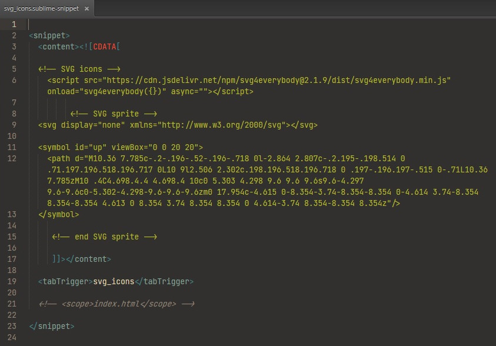

### Create new snippet
Create a new snippet, go to **Tools > Developer > New Snippet**

This step creates an empty file for you to enter your new code snippet into. It should look like the following:

	<snippet>
	  <content><![CDATA[
	Hello, ${1:this} is a ${2:snippet}.
	]]></content>
	  <!-- Optional: Set a tabTrigger to define how to trigger the snippet -->
	  <!-- <tabTrigger>hello</tabTrigger> -->
	  <!-- Optional: Set a scope to limit where the snippet will trigger -->
	  <!-- <scope>source.python</scope> -->
	</snippet>
	
### Customize your new snippet
The code for your new snippet will go between 

	<content><![CDATA[
		Hello, ${1:this} is a ${2:snippet}.
	]]></content>
		
Let's make a new snippet that adds some HTML code & JS code to HTML file, the `svg_icons` rules for example. 
To make this a snippet we could do this:

```
<snippet>

  <content><![CDATA[

  <!-- SVG icons -->
    <script src="https://cdn.jsdelivr.net/npm/svg4everybody@2.1.9/dist/svg4everybody.min.js" 
    onload="svg4everybody({})" async=""></script>

         <!-- SVG sprite -->
  <svg display="none" xmlns="http://www.w3.org/2000/svg"></svg>

  <symbol id="up" viewBox="0 0 20 20">
    <path d="M10.36 7.785c-.2-.196-.52-.196-.718 0l-2.864 2.807c-.2.195-.198.514 
    0 .71.197.196.518.196.717 0L10 9l2.506 2.302c.198.196.518.196.718 
    0 .197-.196.197-.515 0-.71L10.36 7.785zM10 .4C4.698.4.4 4.698.4 10c0 5.303 
    4.298 9.6 9.6 9.6s9.6-4.297 9.6-9.6c0-5.302-4.298-9.6-9.6-9.6zm0 
    17.954c-4.615 0-8.354-3.74-8.354-8.354 0-4.614 3.74-8.354 
    8.354-8.354 4.613 0 8.354 3.74 8.354 8.354 0 4.614-3.74 8.354-8.354 8.354z"/>
  </symbol>

     <!-- end SVG sprite -->

     ]]></content>

  <tabTrigger>svg_icons</tabTrigger>

  <!-- <scope>index.html</scope> -->
  
</snippet>
```	
Outside of the code that we need in the snippet there are two additional lines of code.

`<tabTrigger> svg_icons </tabTrigger>` is the string you will enter at any line in your project code. 

`<scope>index.html</scope>` this is optional. This will restrict the use of this snippet to that file type. 

### Save the file
You would think that this would be straight forward, but it's not. First you want to make sure that you are saving it in the proper directory

~/Library/Application Support/Sublime Text 2/Packages/User

Then, I would suggest making sub-directories here, something like `snippets` and then organizing a sub-directory in there as well. Something like `snippets/css` for example. 

#### Add the file extension 
When you hit the save button, notice that the file window simply says `untitled`. Be sure to add the `.sublime-snippet` file extension. 

### Use the new snippet
You are now ready to use your new snippet. So that this example works, be sure to open/create a `.css` file. Remember, we scoped this snippet to that file type. 

Line one type in `svg_icons` + `tab` and your snippet should appear.
	
That's all! 
