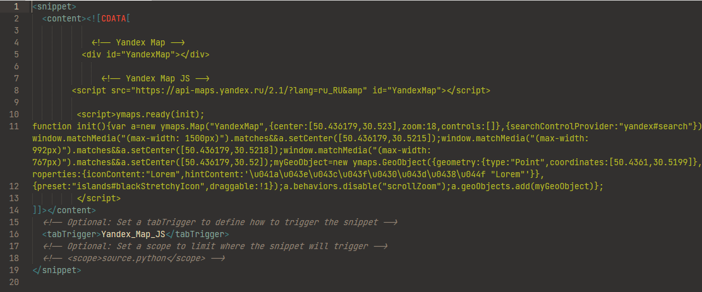

# How to create snippets in Sublime Text

### Create new snippet
Create a new snippet, go to **Tools > Developer > New Snippet**

This step creates an empty file for you to enter your new code snippet into. It should look like the following:

	<snippet>
	  <content><![CDATA[
	Hello, ${1:this} is a ${2:snippet}.
	]]></content>
	  <!-- Optional: Set a tabTrigger to define how to trigger the snippet -->
	  <!-- <tabTrigger>hello</tabTrigger> -->
	  <!-- Optional: Set a scope to limit where the snippet will trigger -->
	  <!-- <scope>source.python</scope> -->
	</snippet>
	
### Customize your new snippet
The code for your new snippet will go between 

	<content><![CDATA[
		Hello, ${1:this} is a ${2:snippet}.
	]]></content>
		
Let's make a new snippet that adds some HTML code & JS code to HTML, the `Yandex_Map_JS` rules for example. To make this a snippet we could do this:

	<snippet>
	
		<content><![CDATA[	
			
		<!-- Yandex Map -->
          

       

              <!-- Yandex Map JS -->
        

         
	 
		]]></content>
		
		<tabTrigger>Yandex_Map_JS</tabTrigger>
		<scope>source.css, source.html, source.htm</scope>
		
	</snippet>
	
Notice the indention of the CSS rules, I did that for a reason. White space will be represented in the output of the snippet. Test it out for yourself.

Outside of the code that we need in the snippet there are two additional lines of code.

`<tabTrigger> ... </tabTrigger>` is pretty self explanatory. What you put in here is the string you will enter at any line in your project code and then hit the `tab` key. 

`<scope> ... </scope>` this is optional. By putting in a source type, this will restrict the use of this snippet to that file type. 

	<scope>source.css, source.html, source.htm</scope>

### Save the file
You would think that this would be straight forward, but it's not. First you want to make sure that you are saving it in the proper directory

	~/Library/Application Support/Sublime Text 2/Packages/User

Then, I would suggest making sub-directories here, something like `snippets` and then organizing a sub-directory in there as well. Something like `snippets/css` for example. 

#### Add the file extension 
When you hit the save button, notice that the file window simply says `untitled`. Be sure to add the `.sublime-snippet` file extension. 

### Use the new snippet
You are now ready to use your new snippet. So that this example works, be sure to open/create a `.css` file. Remember, we scoped this snippet to that file type. 

Line one type in `Yandex_Map_JS` + `tab` and your snippet should appear.
	
### Conclusion
That's all! 
